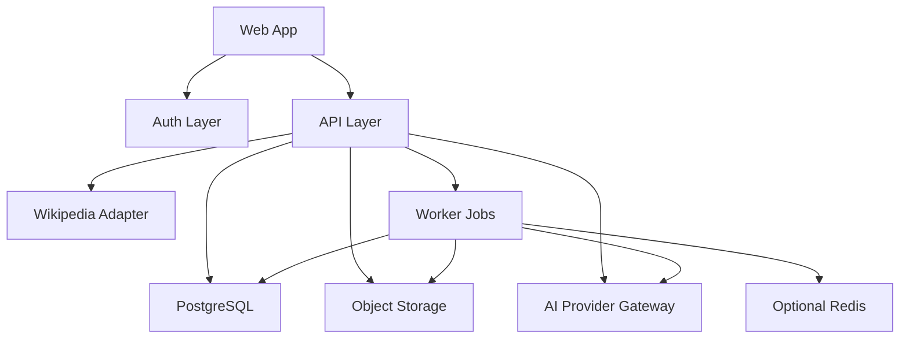

# The Vault 2.0 Architecture

Status: Draft  
Phase: 2.0-alpha  
Architectural Position: boring, durable, source-aware

## Architectural Thesis

The Vault 2.0-alpha should be built as a persistent connectome workspace, not as a platform in search of a market.

The smallest correct cloud leap is:

- user identity
- a personal workspace
- multiple private vaults with owner-only access
- persistent notes and revisions
- durable import and export continuity
- the existing 3D connectome mounted inside a real app shell
- one narrow AI enhancement layer

Everything else should justify itself against that slice.

## Operational Shape

The stack should stay operationally boring:

- one app
- one worker
- PostgreSQL as the canonical database
- object storage for uploads, exports, and artifacts
- optional Redis only if worker load or queue latency makes it necessary

`pgvector` may be installed inside PostgreSQL for future enrichment, but it is not central to alpha.

## Scope Boundary

This architecture is for:

- identity
- personal workspace creation
- private vault ownership
- persistent notes, revisions, and graph state
- Obsidian import and export
- source-aware Wikipedia plus local note workflows
- reviewed AI summary and link suggestion

This architecture is not for:

- collaborative editing
- billing
- broad multi-provider auth support in alpha
- agent orchestration
- adapter sprawl
- premature service decomposition

## Recommended Stack

- Web app: Next.js with TypeScript
- Auth: Auth.js or equivalent OIDC layer
- First auth provider: GitHub
- Database: PostgreSQL
- Optional vector support: `pgvector`
- Worker: background worker process for import, export, and AI jobs
- Object storage: S3-compatible bucket
- Optional queue/cache: Redis only if job volume requires it

## Deployment Shape

### Baseline Cloud Deployment

- `app`
- `worker`
- `postgres`
- `object-storage`
- optional `redis`

That is the deployment shape to optimize for in alpha.

## System Diagram



## Domain Model

### Canonical Tables

- `user`
- `user_identity`
- `workspace`
- `vault`
- `note`
- `note_revision`
- `source_document`
- `edge`
- `import_run`
- `export_run`
- `ai_run`

### Optional Later Tables

- `note_embedding`
- `public_snapshot`

### Key Rules

- `workspace` is personal in alpha, created on first login.
- A user may own multiple private vaults inside that workspace.
- `note` is the canonical editable entity.
- PostgreSQL is the source of truth for vault, note, revision, edge, provenance, and AI audit state.
- `source_document` stores external grounding such as Wikipedia title, URL, extract, and fetch time.
- `note_revision` stores markdown history for direct edits and accepted AI changes.
- `ai_run` stores prompt, inputs, citations, generated output, reviewer action, and final outcome.

## Ownership Model

This phase uses simple private ownership:

- one user
- one personal workspace
- multiple private vaults
- owner-only authorization
- no shared membership model
- no editor or viewer roles

This keeps identity real without dragging in team semantics too early.

## Auth Model

- Use OpenID Connect through one provider first.
- Recommended first provider: GitHub.
- Store provider identity in `user_identity`.
- Keep the auth layer extensible enough for Google or Apple later, but do not build them now.
- Authorization in alpha is workspace-owner and vault-owner checking.

## Persistence Model

- PostgreSQL stores all canonical records.
- Object storage stores raw imports, generated export archives, and future large artifacts.
- Object storage is not the source of truth for notes.
- `pgvector` may be enabled in PostgreSQL, but alpha must not depend on vector infrastructure to function.
- The graph should be rebuilt from canonical note, source, and edge data instead of from transient client state.

## Import Pipeline

1. User uploads a zip or selects markdown files.
2. App stores the raw upload in object storage.
3. App creates an `import_run`.
4. Worker parses markdown, frontmatter, tags, aliases, folders, and wikilinks.
5. Worker compares imported notes against existing Wikipedia-backed and local notes.
6. Overlap is merged where rules match.
7. Worker writes normalized notes, revisions, provenance, and edges into PostgreSQL.
8. Worker emits an import report with overlap and merge visibility.

## Export Pipeline

1. User requests export of the full vault or current graph.
2. API resolves notes, metadata, source annotations, and edges from PostgreSQL.
3. Worker builds an Obsidian-compatible archive.
4. Archive is stored in object storage and streamed to the user.
5. `export_run` records status, size, and completion time.

Export fidelity should be treated as a trust boundary, not as a convenience feature.

## AI Layer

AI is an enhancement layer subordinate to the knowledge model.

### Initial Jobs

- note summary
- link suggestion

### Hard Requirements

- every output must show source inputs
- every output must include citations
- every output must be explicitly reviewed before save
- every output must be written to `ai_run`
- accepted changes create normal `note_revision` records

### Explicitly Deferred

- ask-my-vault as a broad open-ended mode
- autonomous agents
- orchestration systems
- multi-step research runs

## Graph Architecture

- Keep the current 3D connectome renderer as a protected product surface.
- Port it into the new web app shell with minimal conceptual regression.
- Build persistent graph state from canonical PostgreSQL note and edge data.
- Treat connectome navigation as a first-class workflow, not as a visualization layer attached to standard CRUD screens.
- Recognize the dual-rail product strategy:
  - personal workspace mode
  - later public or museum-style read-only presentation mode
- Keep the public rail out of the alpha critical path, but do not damage it through poor core graph decisions.

## Public Snapshot Path

- Do not build collaboration in alpha.
- A later read-only public graph snapshot mode is a better next step than shared editing.
- Public snapshots should reuse the same graph engine and source-aware note model.
- Public snapshots should be operationally separate from private editing permissions.

## API Surface

### Public App API

- `POST /auth/*`
- `GET /workspace`
- `GET /vaults`
- `POST /vaults`
- `GET /vaults/:vaultId`
- `POST /vaults/:vaultId/import`
- `POST /vaults/:vaultId/export`
- `GET /vaults/:vaultId/graph`
- `GET /notes/:noteId`
- `POST /notes`
- `PATCH /notes/:noteId`
- `DELETE /notes/:noteId`
- `POST /ai/summary`
- `POST /ai/link-suggestions`
- `POST /ai/runs/:runId/review`

### Internal Worker Jobs

- `import.process`
- `export.build`
- `ai.summary`
- `ai.link-suggestions`

## Repo Shape

```text
the-vault/
  apps/
    web/
    worker/
  packages/
    auth/
    db/
    note-engine/
    graph-engine/
    wikipedia-adapter/
    obsidian-adapter/
    ai-review/
    ui/
  docs/
    the-vault-2.0-prd.md
    the-vault-2.0-architecture.md
  infra/
    docker/
    terraform/
```

## Package Responsibilities

- `apps/web`: auth screens, workspace shell, connectome workspace, note reader and editor
- `apps/worker`: import, export, summary, and link-suggestion jobs
- `packages/auth`: session and provider configuration
- `packages/db`: schema, migrations, and query layer
- `packages/note-engine`: markdown parsing, wikilink resolution, revision rules, and merge logic
- `packages/graph-engine`: graph construction, diagnostics, and filtering
- `packages/wikipedia-adapter`: search, summary fetch, and source normalization
- `packages/obsidian-adapter`: import and export formatting
- `packages/ai-review`: prompts, citations, review state, and audit helpers
- `packages/ui`: shared components and workspace primitives

## Security Requirements

- encrypt data in transit and at rest
- owner authorization on every vault, note, and export path
- signed download URLs for export artifacts
- audit records for AI runs and accepted changes
- clean separation between provider identity data and app session state

## Immediate Engineering Slice

Build the smallest real 2.0-alpha slice:

- Next.js app shell
- GitHub sign-in
- PostgreSQL schema for user, identity, workspace, vault, note, note revision, source document, edge, import run, export run, and ai run
- personal workspace creation on first login
- multiple private vaults per user
- owner-only authorization checks
- current graph UI mounted inside the new shell
- persistent note and graph reads from PostgreSQL
- worker-based Obsidian import and export
- reviewed AI summary and link suggestion endpoints

If a proposed component does not strengthen this slice, it should wait.
