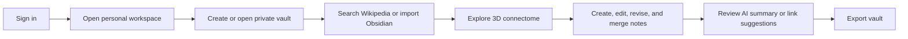

# The Vault 2.0 PRD

Status: Draft  
Phase: 2.0-alpha  
Positioning: The Vault is becoming a persistent, source-aware connectome workspace.

## Product Summary

The Vault 2.0-alpha is the smallest correct leap from the proven `1.1-dev` app into a real cloud product.

`1.1-dev` already proves the core loop:

- Wikipedia as a live source layer
- Obsidian-compatible import and export
- a compelling 3D connectome workflow

The next phase should not turn that into a platform ambition project. It should make that loop persistent and trustworthy:

- user identity
- a personal workspace
- multiple private vaults with owner-only access
- persistent notes and revisions
- durable import and export continuity
- a source-aware graph that survives across sessions
- one narrow AI layer

## What 2.0-alpha Is

- a logged-in connectome workspace
- a persistent personal knowledge environment
- a private vault system built on source-aware notes
- a browser-based graph-native note workspace
- an Obsidian-compatible online and offline bridge
- a carefully reviewed AI enhancement layer

## What 2.0-alpha Is Not

- a collaboration suite
- a billing product
- a multi-provider identity matrix
- an agent orchestration layer
- a general-purpose knowledge platform
- a broad adapter marketplace

## Goals

- Add user identity, a personal workspace, and private vault ownership.
- Support multiple private vaults per user with owner-only access.
- Use PostgreSQL as the canonical source of truth.
- Preserve the 3D connectome as the main workspace surface.
- Make import, merge, revision, and export flows trustworthy.
- Add AI only where it reinforces the knowledge model.

## Non-Goals

- Shared editing in alpha.
- Collaboration roles in alpha.
- Billing, subscriptions, or seat management.
- Google, Apple, and GitHub all at once.
- Agent-style autonomous workflows.
- Embedding-first or vector-first product design.
- Native apps.

## Primary Users

1. Solo researcher  
Needs persistent source-aware notes, durable revisions, and trustworthy export.

2. Structured knowledge builder  
Needs to connect topics, merge sources, and grow a vault through a graph-native workflow.

3. Public curator  
Needs the connectome to remain strong enough to support a later read-only public mode without distorting the alpha roadmap for personal knowledge work.

## Product Principles

- Source-aware by default. Provenance must remain legible.
- Persistence before expansion. Durable ownership matters more than more features.
- Markdown portability is required.
- Graph-native, not graph-only. The connectome is the main workspace surface.
- The connectome has two valid futures: personal knowledge work and public cultural display. Share the engine, not the alpha roadmap.
- AI must assist, not obscure.
- Infrastructure should remain boring and operable.

## Core User Stories

- As a user, I can sign in and land in my personal workspace.
- As a user, I can create and manage multiple private vaults that only I can access in this phase.
- As a user, I can search Wikipedia and build a new live graph.
- As a user, I can import an Obsidian vault and preserve folders, frontmatter, wikilinks, aliases, and tags.
- As a user, I can create, edit, and revise notes that persist in my vault.
- As a user, I can export my vault back out as an Obsidian-compatible archive at any time.
- As a user, I can request an AI summary or AI link suggestions, inspect the citations, and explicitly accept or reject the result.

## Functional Requirements

### 1. Identity, Workspace, and Ownership

- Support sign-in through one OpenID Connect provider in the first release.
- Recommended first provider: GitHub.
- Store a durable user record and a linked identity record.
- Create a personal workspace for the user on first successful login.
- Allow multiple private vaults within that personal workspace.
- Enforce owner-only access control in this phase.

### 2. Persistent Vault Model

- Store notes, revisions, source metadata, and graph edges in PostgreSQL.
- Treat PostgreSQL as the canonical system of record.
- Preserve markdown, frontmatter, folder paths, tags, aliases, and wikilinks.
- Distinguish between:
  - Wikipedia-backed source notes
  - local vault notes
  - merged notes with imported overlays
- Keep note revision history first-class.

### 3. Import, Merge, and Export

- Import zipped Obsidian vaults or markdown folder selections.
- Parse `.md`, `.markdown`, YAML frontmatter, tags, aliases, folders, and `[[wikilinks]]`.
- Merge imported overlap into matching Wikipedia-backed notes where rules match.
- Produce an import report with overlap and merge visibility.
- Annotate imported overlap inside `Note.md`.
- Export the full vault or active graph as an Obsidian-compatible archive.
- Treat export fidelity as a release-level trust requirement.

### 4. Connectome Workspace

- Preserve the current 3D connectome as the main product surface.
- Keep pan, orbit, zoom, focus, search, folder filtering, and inspector flows.
- Persist the current graph across sessions.
- Keep mixed-source graphs readable.
- Do not collapse the product into a conventional note CRUD shell around the graph.

### 5. Notes and Revisions

- Open notes in `Note.md`.
- Create, edit, rename, move, and delete local notes in browser.
- Resolve a new note title against Wikipedia before creating duplicates when appropriate.
- Store revision history for note edits and accepted AI changes.

### 6. AI Enhancement Layer

Ship only two AI actions in alpha:

- note summary
- link suggestion

Every AI output must:

- show source inputs
- cite source notes or Wikipedia pages
- require explicit review before save
- create an auditable run record

AI should reinforce the graph and the note model, not compete with them.

### 7. Public Snapshot Mode

- Do not build collaborative editing yet.
- Consider a read-only public graph snapshot mode before shared editing.
- Public snapshots should reuse the same graph engine and source-aware note model.
- Public snapshots should not force collaboration complexity into alpha.

## Screen Map

### Auth

- brand panel
- single sign-in provider button
- privacy and terms links

### Personal Workspace

- open workspace
- create private vault
- open private vault
- recent vaults
- import vault

### Connectome Workspace

- left sidebar for search, source controls, and vault tree
- center 3D connectome
- right pane for `Note.md` and `Inspector`
- top utility row for export, AI actions, and settings

### Note Editor

- markdown editor
- frontmatter fields
- source provenance
- revision awareness
- AI review block

### Import / Export

- import status
- overlap report
- merge review
- full vault export
- current graph export

## Core Flow

## Success Metrics

- Activation: user signs in and opens a vault successfully.
- Ownership clarity: users can manage multiple private vaults without access ambiguity.
- Persistence: users return and find notes, revisions, and graph state intact.
- Portability: exports reopen cleanly in Obsidian.
- Graph usage: users continue to navigate through the connectome rather than abandoning it for flat lists.
- AI trust: accepted summaries and link suggestions materially exceed rejected ones without citation regressions.

## Release Plan

### Now

- user accounts
- personal workspace
- multiple private vaults per user
- owner-only authorization
- PostgreSQL persistence
- note revisions
- Obsidian import and export
- import reports and merge visibility
- persistent connectome workspace
- AI summary
- AI link suggestion

### Later

- additional auth providers
- read-only public graph snapshots
- richer AI operations
- deeper retrieval features

### Not Yet

- collaboration
- shared editing
- billing
- multi-provider sprawl
- agent orchestration
- platform-style adapter expansion

## External Positioning

Use this framing:

The Vault is becoming a persistent, source-aware connectome workspace.

Do not position this phase as “becoming a platform.” The sharper promise is persistence, provenance, portability, and a graph-native workspace users can trust with real knowledge work.

## Risks

- Import and export fidelity can break trust if Obsidian round-tripping is lossy.
- The graph can become secondary if cloud work overwhelms the workspace thesis.
- AI can erode trust if summaries and link suggestions are not well-cited and explicitly reviewed.
- Scope creep can weaken alpha if collaboration, billing, or provider sprawl is allowed in early.
