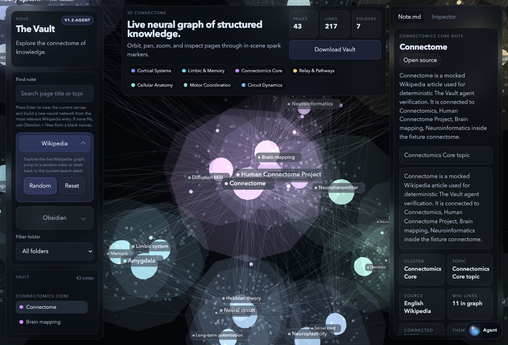
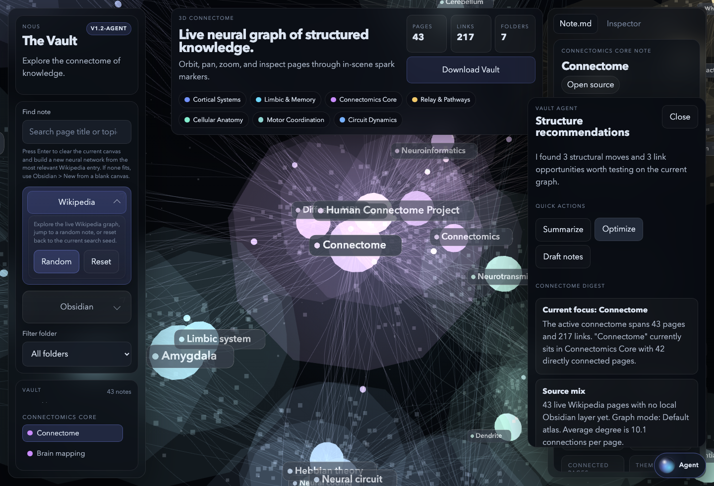
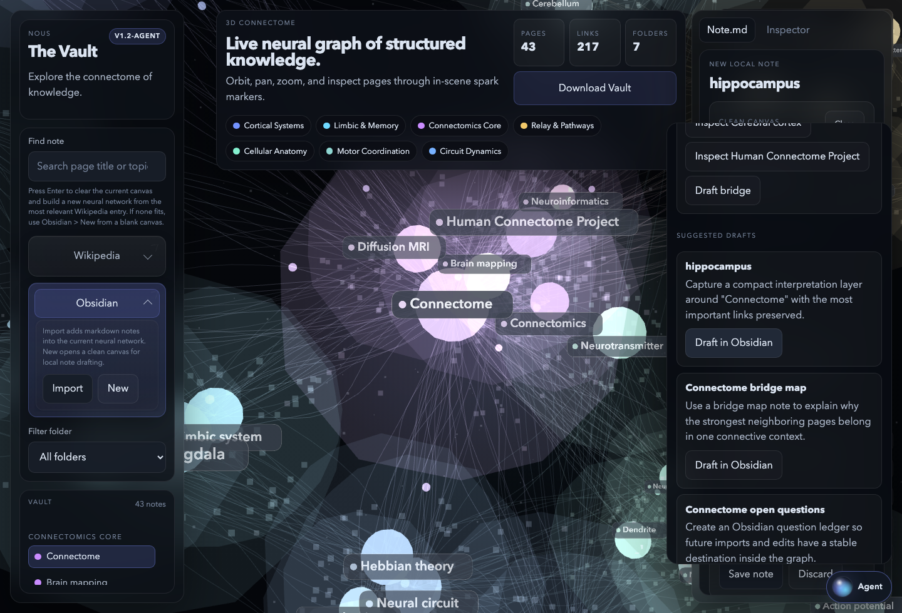

# The Vault Agent Guide

`The Vault Agent` is the floating assistant in the bottom-right corner of the `v1.2-agent` build.

It is designed as a graph-native copilot for the live connectome, not as a detached chatbot tab. It stays available while you inspect sparks, search Wikipedia, and draft Obsidian notes.

## What It Does

The current agent prototype can:

- summarize the active connectome
- highlight structure pressure in the current graph
- suggest missing or weak link opportunities
- draft Obsidian-compatible notes from the current graph context
- open bridge-note drafts between graph regions
- respond to short chat prompts grounded in the current connectome

It does **not** autonomously edit notes, rewrite the graph, or save anything without explicit user action.

## Screenshots

These screenshots are captured from the local verified fixture run, using the same mocked Wikipedia layer as the smoke test so the graph state is deterministic.

### Bubble On The Live Connectome



### Open Panel With Structure Guidance



### Draft Opened In The Existing Editor



## Where It Lives

- launcher: bottom-right floating bubble labeled `Agent`
- open state: compact floating panel above the bubble
- close methods:
  - click `Close`
  - press `Escape`
  - click outside the panel

If you do not see the bubble, open:

`http://127.0.0.1:8765/index.html?refresh=1`

That forces the current CSS and JS bundle instead of a cached older layout.

## What The Agent Reads

The prototype is graph-grounded. It builds its responses from:

- the current seed topic
- the selected or focused note
- the visible page count and link count
- folder / cluster distribution
- strongest hubs in the current graph
- neighboring pages around the focused note
- the current mix of Wikipedia pages and local Obsidian notes

## Main Controls

### Summarize

Use `Summarize` when you want a compact reading of the current graph.

It reports:

- current focus note
- page and link count
- source mix
- dominant folders
- major hubs

### Optimize

Use `Optimize` when you want structural guidance instead of a plain summary.

It reports:

- interpretation-layer recommendations
- folder-balance pressure
- bridge-context recommendations
- graph-derived link opportunities

### Draft Notes

Use `Draft notes` when you want note candidates prepared from the current graph.

It creates draft directions such as:

- a research brief
- a bridge map
- an open questions note

Each draft opens directly into the existing Obsidian note editor and still requires review before saving.

## Link Opportunities

The `Link Opportunities` section is meant to help tighten the connectome.

Each card may offer:

- `Inspect …` buttons to focus notes involved in the opportunity
- `Draft bridge` to create a bridge-note draft between two pages that currently depend on the same hub but do not connect clearly to each other

This is the first agent behavior aimed at reorganizing the connectome instead of only describing it.

## Chat Prompts

The agent chat is lightweight and intent-driven. Good prompt styles are:

- `summarize this connectome`
- `optimize the structure`
- `draft a note about hippocampus`
- `add a note about memory consolidation`
- `how should I connect these folders`

Current intent handling:

- summary prompts trigger graph digest behavior
- structure prompts trigger optimization and link suggestions
- draft prompts prepare Obsidian drafts
- general prompts return guidance about what the prototype can do

## Draft Behavior

Drafts do not save automatically.

When a draft is opened:

- the editor appears in the existing `Note.md` workflow
- the generated title is prefilled
- the folder is prefilled
- markdown is prefilled with wikilinks to the current graph context

For prompts like `draft a note about hippocampus`, the requested title is preserved and opened as the draft title.

## Recommended Workflow

1. Search a topic in `Find note`.
2. Let the app build a new Wikipedia connectome.
3. Select an interesting spark or note.
4. Open the `Agent` bubble.
5. Run `Summarize` or `Optimize`.
6. Use `Draft notes` or `Draft bridge` to open a new Obsidian note.
7. Refine the draft in `Note.md`.
8. Save only if the note improves the graph.

## Current Limits

This prototype is intentionally narrow.

It is currently:

- graph-grounded, but not backed by a remote LLM
- heuristic, not semantic-search driven
- source-aware, but not citation-complete in the way a future reviewed AI layer should be
- interactive, but not autonomous

It should be treated as a connectome copilot, not a general-purpose assistant.

## Verification

The current agent build is verified with the root smoke test:

```bash
npm run smoke:agent
```

The screenshots in this document can be regenerated with:

```bash
npm run capture:agent-docs
```

That test checks:

- the bubble renders in the bottom-right
- the panel opens and closes
- summary and optimize actions work
- link opportunities render
- bridge drafting opens the editor
- chat-driven draft requests open the correct note title

## Files

The current agent implementation lives in:

- [/Users/mini/Documents/New project/index.html](/Users/mini/Documents/New%20project/index.html)
- [/Users/mini/Documents/New project/styles.css](/Users/mini/Documents/New%20project/styles.css)
- [/Users/mini/Documents/New project/script.js](/Users/mini/Documents/New%20project/script.js)
