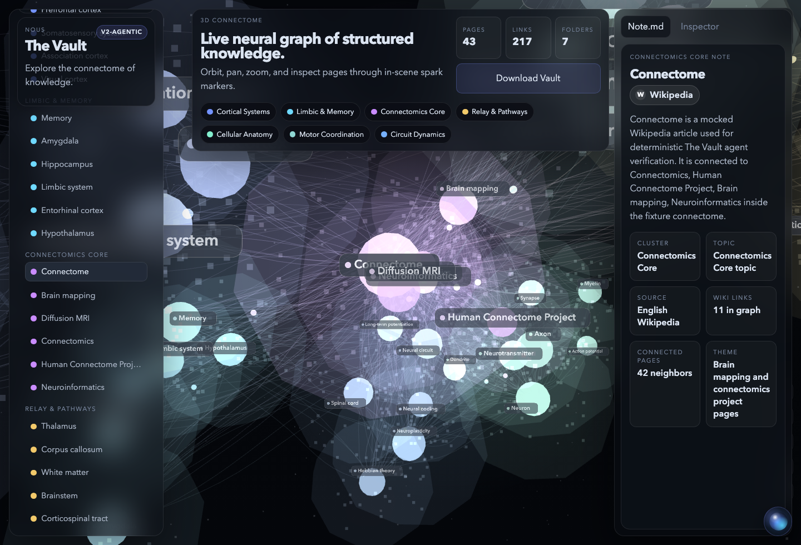
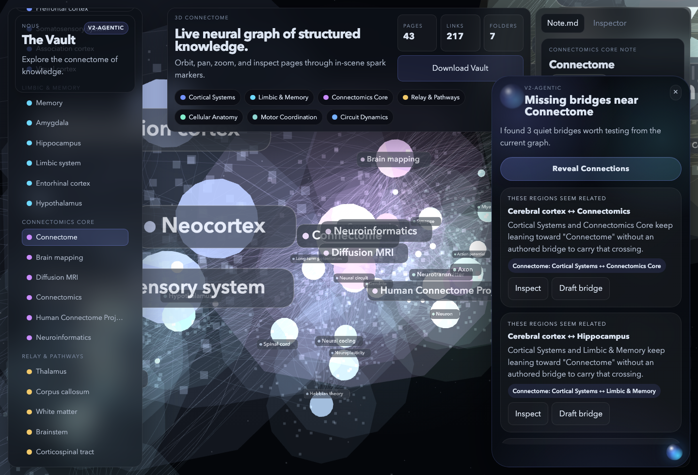
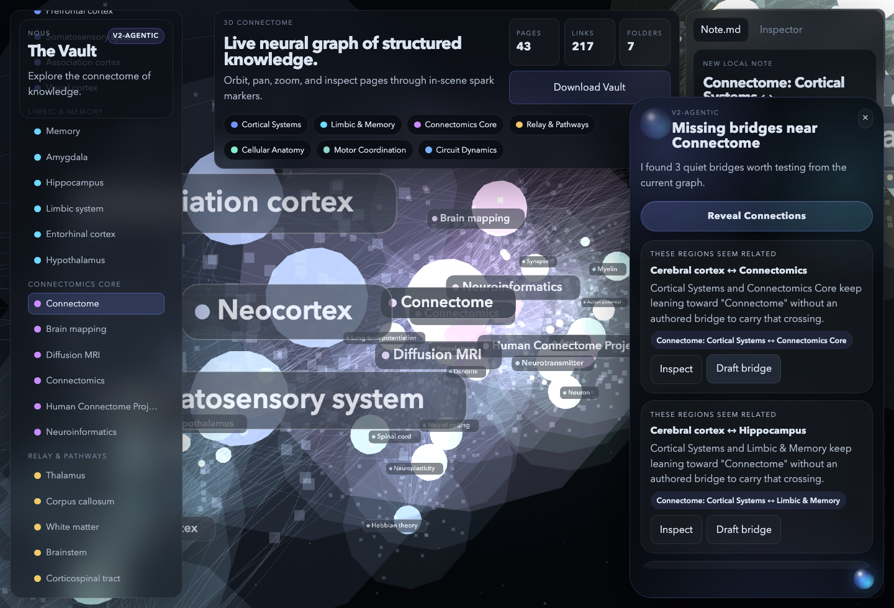

# The Vault NOUS

`v2-agentic` replaces the old assistant concept.

It is no longer a floating utility panel for summary, optimization, and drafting. It is now a small graph-native presence whose main purpose is to reveal missing connections inside the current connectome.

## Core Identity

The agent has only two roles:

1. `Reveal Connections`
2. `Chat`

`Reveal Connections` is primary.

Chat is secondary and stays grounded in the same relation-finding logic.

## Screenshots

These screenshots are captured from the verified mocked graph fixture so the documented state is deterministic.

### Hover State



### Open Chamber



### Draft Bridge



## How It Works

### Idle

- a small bubble sits in the bottom-right corner
- on hover, it expands slightly and reveals the `NOUS` label

### Open

- clicking the bubble opens a larger conversational chamber
- the open state contains one primary action: `Reveal Connections`
- below it, the agent shows 1–3 bridge suggestions
- below that, chat remains available as a lightweight shell

## What NOUS Reveals

Each bridge suggestion is designed to answer:

- what seems related but is not explicitly connected
- what crossing between regions may still need an authored bridge
- what bridge-note might improve the connectome

Each suggestion includes:

- `Inspect`
- `Draft bridge`

## Suggested Workflow

1. Search or focus a note in the graph.
2. Open the `NOUS` bubble.
3. Press `Reveal Connections`.
4. Read the 1–3 suggested bridges.
5. Use `Inspect` to move toward one missing relation.
6. Use `Draft bridge` to open a bridge-note directly inside the NOUS chamber.

## Chat

Chat is intentionally narrow.

Use it for prompts like:

- `show me the missing bridge around hippocampus`
- `where is the gap in this region`
- `what bridge is missing here`
- `which bridge note should I add`

The agent will not foreground graph statistics or a full graph summary. If asked broadly, it still routes back to relation discovery.

## What It Does Not Do

`v2-agentic` does not:

- summarize the whole graph as a primary task
- behave like a dashboard
- expose multiple utility tools
- act like a generic chatbot
- save notes automatically

## Verification

The current implementation is verified with:

```bash
npm run smoke:agent
```

For the full product stabilization loop:

```bash
npm run smoke:stability
```

That smoke test checks:

- bottom-right bubble position
- hover expansion
- chamber open/close
- `Reveal Connections`
- 1–3 bridge suggestions
- `Inspect`
- `Draft bridge`
- secondary chat behavior

You can regenerate the screenshots with:

```bash
npm run capture:agent-docs
```

## Files

- [/Users/mini/Documents/New project/index.html](/Users/mini/Documents/New%20project/index.html)
- [/Users/mini/Documents/New project/styles.css](/Users/mini/Documents/New%20project/styles.css)
- [/Users/mini/Documents/New project/script.js](/Users/mini/Documents/New%20project/script.js)
- [/Users/mini/Documents/New project/scripts/smoke-agent-ui.mjs](/Users/mini/Documents/New%20project/scripts/smoke-agent-ui.mjs)
