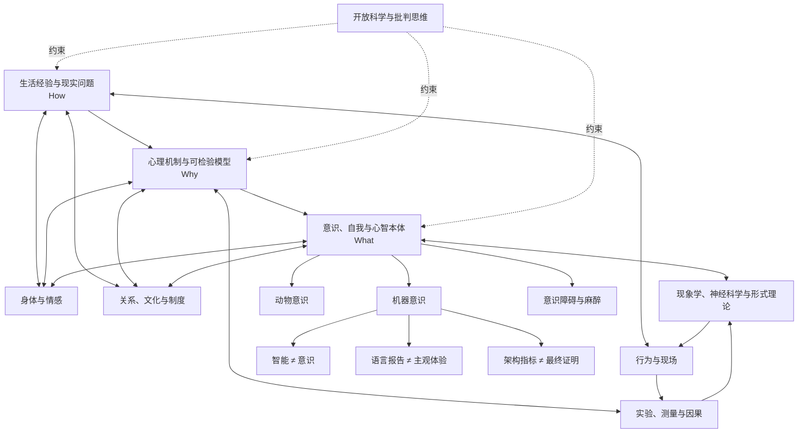

# 心理学思想与意识研究完整谱系
## Psychology Genealogy Atlas

> [!important] 使用说明
> **How → Why → What 是导航模型，不是学界公认的等级制度。**
>
> - **How｜应用**：怎样改变经验、行为与生活？
> - **Why｜机制**：心理与行为为何如此运作？
> - **What｜本质**：意识、自我、心智与现实究竟是什么？
>
> “更深”不等于“更可靠”。  
> 应用心理学可以拥有强实证基础；意识哲学也可能停留在高度推测。  
> 因此，本地图同时使用五条坐标轴：
>
> 1. **问题深度**：How → Why → What  
> 2. **解释尺度**：分子 → 神经元 → 脑网络 → 个体 → 关系 → 社会文化  
> 3. **证据强度**：体验 → 观察 → 相关 → 实验 → 因果 → 形式模型  
> 4. **时间谱系**：哲学心灵 → 实验心理学 → 认知科学 → 神经科学 → 意识科学 → AI心智  
> 5. **主体位置**：第一人称 → 第二人称 → 第三人称

---

# 0｜总入口：一张不是金字塔的地图

- [[心理学 Psychology]]
  - 核心对象
    - [[经验 Experience]]
    - [[行为 Behavior]]
    - [[认知 Cognition]]
    - [[情绪 Emotion]]
    - [[自我 Self]]
    - [[关系 Relationship]]
    - [[身体 Body]]
    - [[大脑 Brain]]
    - [[意识 Consciousness]]
    - [[文化 Culture]]
    - [[人工心智 Artificial Mind]]

  - 三类核心问题
    - How｜应用与改变
      - 如何减轻痛苦？
      - 如何学习与成长？
      - 如何建立关系？
      - 如何形成有意义的生活？
      - 如何改变行为与制度？
    - Why｜机制与解释
      - 感知、记忆、情绪和决策如何产生？
      - 心理状态如何成为行为？
      - 个体差异从何而来？
      - 身体、环境与文化怎样塑造心智？
    - What｜本质与边界
      - 什么是意识？
      - 什么是“我”？
      - 主观体验如何可能？
      - 心智是否等同于计算？
      - 机器、动物和群体能否成为主体？

  - 重要纠偏
    - 应用 ≠ 浅薄
    - 机制 ≠ 完整解释
    - 神经相关 ≠ 心理原因
    - 大脑 ≠ 孤立心智
    - 主观报告 ≠ 不科学
    - 数学模型 ≠ 自动真实
    - 意识研究 ≠ 已解决意识
    - 智能 ≠ 意识
    - 语言表现 ≠ 主体体验
    - 自我叙述 ≠ 自我本身

---

# 1｜第一轴：问题深度 How → Why → What

- 第一层｜How：应用、调节与生活实践
  - 目标
    - 降低痛苦
    - 提升功能
    - 增加幸福感与意义
    - 改善关系
    - 促进学习和行为改变
  - 典型问题
    - 如何处理焦虑、压力与失落？
    - 如何形成习惯？
    - 如何提升专注与心流？
    - 如何改善亲密关系和群体合作？
    - 如何找到价值方向？
  - 核心内容
    - 心理健康素养
    - 情绪识别与调节
    - 行为改变
    - 沟通与冲突
    - 目标、价值与意义
    - 创伤知情实践
    - 教育、组织与社区干预
  - 方法
    - 心理教育
    - 日记与自我监测
    - 行为激活
    - 暴露与反应预防
    - 认知重评
    - 正念训练
    - 动机访谈
    - 团体干预
    - 环境与制度设计
  - 主要传统
    - [[认知行为疗法 CBT]]
      - [[Aaron T. Beck]]
      - 认知三联征
      - 自动思维
      - 核心信念
      - 行为实验
    - [[理性情绪行为疗法 REBT]]
      - [[Albert Ellis]]
    - [[接纳与承诺疗法 ACT]]
      - 心理灵活性
      - 价值导向行动
      - 认知解离
    - [[辩证行为疗法 DBT]]
      - [[Marsha Linehan]]
    - [[人本主义心理学]]
      - [[Carl Rogers]]
      - [[Abraham Maslow]]
    - [[存在主义心理治疗]]
      - [[Viktor Frankl]]
      - [[Rollo May]]
      - [[Irvin Yalom]]
    - [[积极心理学]]
      - [[Martin Seligman]]
      - [[Mihaly Csikszentmihalyi]]
      - [[PERMA]]
    - [[自我决定理论 SDT]]
      - [[Edward Deci]]
      - [[Richard Ryan]]
      - 自主
      - 胜任
      - 关系
    - [[正念与心理治疗]]
      - [[Jon Kabat-Zinn]]
      - MBSR
      - MBCT
  - 风险
    - 把结构性问题个体化
    - 把“幸福”变成绩效命令
    - 用人格标签替代情境分析
    - 把短期情绪改善误作深层改变
    - 把教练、咨询与临床治疗混为一谈
    - 用“开放心态”压制异议

- 第二层｜Why：科学机制与可检验模型
  - 目标
    - 描述
    - 解释
    - 预测
    - 干预
    - 建模
  - 核心问题
    - 刺激如何成为知觉？
    - 记忆如何编码、储存与提取？
    - 情绪如何调动身体和行动？
    - 决策为何偏离规范理性？
    - 人格和依恋如何发展？
    - 社会情境如何塑造判断？
  - 主要领域
    - [[认知心理学]]
      - 知觉
      - 注意
      - 记忆
      - 语言
      - 推理
      - 决策
    - [[发展心理学]]
      - 婴儿认知
      - 依恋
      - 语言发展
      - 道德发展
      - 生命周期
    - [[社会心理学]]
      - 从众
      - 服从
      - 归因
      - 社会认同
      - 偏见
      - 群体极化
    - [[人格心理学]]
      - 特质理论
      - 五大人格
      - 情境主义
      - 人格—情境互动
    - [[情绪科学]]
      - 基本情绪
      - 评价理论
      - 建构主义情绪理论
      - 内感受
    - [[学习科学]]
      - 条件作用
      - 强化学习
      - 观察学习
      - 预测误差
    - [[心理测量学]]
      - 信度
      - 效度
      - 潜变量
      - 项目反应理论
    - [[临床科学]]
      - 精神病理机制
      - 诊断模型
      - 跨诊断维度
      - 计算精神病学
    - [[文化心理学]]
      - 独立自我与互依自我
      - WEIRD样本偏差
      - 本土心理学
      - 文化演化
  - 主要方法
    - 实验设计
    - 随机对照试验
    - 纵向研究
    - 自然实验
    - 行为任务
    - 问卷与量表
    - 访谈与质性研究
    - 元分析
    - 贝叶斯推断
    - 因果推断
    - 计算模型
    - 生态瞬时评估 EMA
  - 风险
    - 把统计显著误作理论重要
    - 把相关误作因果
    - 把操作化指标误作概念本身
    - 把群体平均误作个体规律
    - 把实验室任务误作真实生活
    - 忽视文化、身体和权力结构

- 第三层｜What：意识、自我与心智本体
  - 目标
    - 确定要解释的现象
    - 建立意识理论
    - 连接主观体验与客观机制
    - 界定人、动物与机器的心智边界
  - 核心问题
    - 为什么会有“某种感觉”？
    - 意识是功能、信息、表征、动力学还是生命过程？
    - 自我是实体、模型、叙事还是关系？
    - 感知是读取世界还是生成世界？
    - 意识是否需要身体、情感和生物性？
    - 一个系统何时值得道德关切？
  - 基本区分
    - 现象意识 Phenomenal Consciousness
      - “体验起来是什么样”
    - 通达意识 Access Consciousness
      - 信息能否用于报告、推理和控制
    - 状态意识 State Consciousness
      - 清醒、睡眠、麻醉、昏迷
    - 内容意识 Content Consciousness
      - 当下具体体验到什么
    - 自我意识 Self-consciousness
      - 自我表征
      - 元认知
      - 主体性
    - 意识水平 Level
    - 意识内容 Content
  - 方法
    - 心理物理学
    - 阈下刺激与掩蔽
    - 双眼竞争
    - 无报告范式
    - 神经影像
    - 颅内记录
    - 脑刺激
    - 病损研究
    - 麻醉与睡眠研究
    - 意识障碍研究
    - 第一人称微现象学
    - 计算与信息理论
    - 对抗式合作
  - 风险
    - 把报告机制误作意识机制
    - 把神经相关物误作充分解释
    - 理论不可证伪
    - 概念定义彼此错位
    - 过度依赖视觉实验
    - 把人类语言能力当作意识标准
    - 对AI进行拟人化投射

---

# 2｜第二轴：历史谱系

- A｜哲学与医学前史
  - 古希腊
    - [[Plato]]
      - 灵魂三分
      - 理性、激情、欲望
    - [[Aristotle]]
      - 《论灵魂 De Anima》
      - 心灵作为生命体功能
      - 感知、记忆、想象
    - [[Hippocrates]]
      - 身体与气质
  - 中国思想
    - [[孔子]]
      - 修身与关系性人格
    - [[庄子]]
      - 自我边界、梦与知觉
    - [[荀子]]
      - 性、习惯与礼的塑造
    - [[王阳明]]
      - 知行合一
  - 印度与佛教心识传统
    - 五蕴
    - 无我
    - 缘起
    - 注意与观照训练
    - 经验过程论
  - 近代欧洲
    - [[René Descartes]]
      - 身心二元论
      - 我思
    - [[John Locke]]
      - 经验主义
      - 人格同一性与记忆
    - [[David Hume]]
      - 自我束理论
    - [[Immanuel Kant]]
      - 先验结构
      - 统觉统一
    - [[Franz Brentano]]
      - 意向性
    - [[William Hamilton]]
      - 无意识推理先声

- B｜生理学、心理物理学与实验心理学
  - [[Ernst Weber]]
    - 差别阈限
  - [[Gustav Fechner]]
    - 心理物理学
    - 刺激与感觉的定量关系
  - [[Hermann von Helmholtz]]
    - 神经传导速度
    - 无意识推断
  - [[Franciscus Donders]]
    - 心理计时
    - 减法法
  - [[Wilhelm Wundt]]
    - 生理心理学
    - 实验室制度化
  - [[Hermann Ebbinghaus]]
    - 无意义音节
    - 遗忘曲线
  - [[Francis Galton]]
    - 个体差异
    - 测量传统
    - 同时留下优生学遗产
  - [[Alfred Binet]]
    - 智力测验
    - 教育评估

- C｜早期学派分岔
  - [[结构主义 Structuralism]]
    - [[Edward Titchener]]
    - 分解意识内容
  - [[功能主义 Functionalism]]
    - [[William James]]
    - 意识流
    - 心智的适应功能
    - [[John Dewey]]
  - [[精神分析 Psychoanalysis]]
    - [[Sigmund Freud]]
      - 无意识
      - 冲突
      - 防御
      - 移情
    - [[Carl Jung]]
    - [[Melanie Klein]]
    - [[Donald Winnicott]]
    - [[Jacques Lacan]]
  - [[行为主义 Behaviorism]]
    - [[John B. Watson]]
      - 可观察行为
    - [[Ivan Pavlov]]
      - 条件反射
    - [[Edward Thorndike]]
      - 效果律
    - [[B. F. Skinner]]
      - 操作性条件作用
    - [[Clark Hull]]
  - [[格式塔心理学 Gestalt]]
    - [[Max Wertheimer]]
    - [[Wolfgang Köhler]]
    - [[Kurt Koffka]]
    - 整体不等于部分之和
    - 知觉组织
  - [[目的行为主义]]
    - [[Edward Tolman]]
    - 认知地图
    - 潜伏学习

- D｜发展、社会、人格与临床扩张
  - 发展
    - [[Jean Piaget]]
      - 发生认识论
    - [[Lev Vygotsky]]
      - 社会文化发展
      - 最近发展区
    - [[John Bowlby]]
      - 依恋
    - [[Mary Ainsworth]]
      - 陌生情境
    - [[Urie Bronfenbrenner]]
      - 生态系统理论
  - 社会
    - [[Kurt Lewin]]
      - 行为是人与环境的函数
    - [[Solomon Asch]]
      - 从众
    - [[Stanley Milgram]]
      - 服从
    - [[Leon Festinger]]
      - 认知失调
    - [[Henri Tajfel]]
      - 社会认同
    - [[Albert Bandura]]
      - 社会学习
      - 自我效能
  - 人格
    - [[Gordon Allport]]
    - [[Raymond Cattell]]
    - [[Hans Eysenck]]
    - [[Big Five]]
    - [[Walter Mischel]]
      - 人格—情境争论
  - 临床
    - [[Carl Rogers]]
      - 来访者中心疗法
    - [[Aaron Beck]]
      - 认知疗法
    - [[Albert Ellis]]
      - REBT
    - [[Joseph Wolpe]]
      - 系统脱敏
    - [[Marsha Linehan]]
      - DBT
    - [[Steven Hayes]]
      - ACT

- E｜认知革命与信息加工
  - 外部条件
    - [[Claude Shannon]]
      - 信息论
    - [[Alan Turing]]
      - 机器智能
    - [[Norbert Wiener]]
      - 控制论
    - 计算机科学兴起
    - 语言学转向
  - 关键节点
    - [[George Miller]]
      - 工作记忆容量
      - 认知科学制度化
    - [[Noam Chomsky]]
      - 对行为主义语言观的批判
    - [[Jerome Bruner]]
      - 意义与认知
    - [[Ulric Neisser]]
      - 《Cognitive Psychology》
    - [[Herbert Simon]]
    - [[Allen Newell]]
      - 符号主义
      - 问题求解
    - [[Donald Broadbent]]
      - 注意过滤模型
    - [[Alan Baddeley]]
      - 工作记忆
  - 核心隐喻
    - 心智作为信息处理器
    - 表征
    - 编码
    - 储存
    - 检索
    - 算法

- F｜认知神经科学与计算化
  - 神经机制
    - [[Donald Hebb]]
      - 细胞集合
      - 赫布学习
    - [[David Hubel]]
    - [[Torsten Wiesel]]
      - 视觉皮层
    - [[Roger Sperry]]
    - [[Michael Gazzaniga]]
      - 裂脑研究
    - [[Eric Kandel]]
      - 学习与突触可塑性
    - [[Joseph LeDoux]]
      - 恐惧回路
    - [[Antonio Damasio]]
      - 躯体标记
    - [[Jaak Panksepp]]
      - 情感神经科学
  - 计算层次
    - [[David Marr]]
      - 计算目标
      - 算法与表征
      - 物理实现
  - 决策科学
    - [[Daniel Kahneman]]
    - [[Amos Tversky]]
      - 启发式与偏差
      - 前景理论
    - [[Reinforcement Learning]]
      - 奖赏预测误差
      - 多巴胺模型
  - 连接主义
    - [[David Rumelhart]]
    - [[James McClelland]]
    - 并行分布式加工
    - 神经网络
  - 贝叶斯与生成模型
    - 贝叶斯脑
    - 预测编码
    - 主动推断
    - [[Karl Friston]]

- G｜生态、具身、延展与生成式心智
  - [[James J. Gibson]]
    - 生态知觉
    - 可供性 Affordance
    - 直接知觉
  - [[Francisco Varela]]
  - [[Evan Thompson]]
  - [[Eleanor Rosch]]
    - 具身心智
    - 生成认知 Enactivism
  - [[Maurice Merleau-Ponty]]
    - 身体主体
  - [[Alva Noë]]
    - 感知作为行动
  - [[Kevin O’Regan]]
    - 感觉运动偶联
  - [[Andy Clark]]
    - 预测心智
    - 延展认知
  - [[David Chalmers]]
    - 延展心智
  - [[Lisa Feldman Barrett]]
    - 建构情绪
    - 身体预算
  - 核心转变
    - 大脑中心主义
      - ↓
    - 脑—身体—环境耦合
      - ↓
    - 心智作为动态生成过程

- H｜文化、批判与权力谱系
  - [[Lev Vygotsky]]
    - 心理功能由文化工具中介
  - [[Alexander Luria]]
    - 文化历史神经心理学
  - [[Michael Cole]]
    - 文化心理学
  - [[Hazel Markus]]
  - [[Shinobu Kitayama]]
    - 独立自我与互依自我
  - [[Richard Shweder]]
    - 文化心理学
  - [[Carol Gilligan]]
    - 关怀伦理
    - 性别化发展模型批判
  - [[Frantz Fanon]]
    - 殖民经验与主体
  - [[Michel Foucault]]
    - 疯癫、规训与知识制度
  - [[Ignacio Martín-Baró]]
    - 解放心理学
  - [[WEIRD样本问题]]
    - 西方
    - 受教育
    - 工业化
    - 富裕
    - 民主社会
  - 核心追问
    - 谁定义正常？
    - 哪种人被当作默认人类？
    - 心理问题有多少来自社会结构？
    - 测量工具是否跨文化有效？

- I｜开放科学与心理学自我修正
  - 问题
    - 发表偏差
    - 小样本
    - p-hacking
    - HARKing
    - 低统计功效
    - 构念效度不足
    - 复现失败
  - 关键节点
    - [[Paul Meehl]]
      - 软心理学的理论风险
    - [[John Ioannidis]]
      - 研究结论可靠性危机
    - [[Open Science Collaboration]]
      - 大规模复现
    - [[Brian Nosek]]
      - 开放科学基础设施
  - 方法改革
    - 预注册
    - 注册报告
    - 开放数据
    - 开放材料
    - 多实验室合作
    - 对抗式合作
    - 贝叶斯分析
    - 等效性检验
    - 多宇宙分析
  - 认识论结论
    - 心理学不是固定答案库
    - 心理学是一套持续纠错的研究程序

---

# 3｜第三轴：解释尺度

- 分子与细胞
  - 神经递质
  - 受体
  - 基因表达
  - 突触可塑性
  - 内分泌
- 神经回路
  - 感觉通路
  - 奖赏系统
  - 威胁系统
  - 内感受网络
- 大尺度脑网络
  - 默认网络
  - 显著性网络
  - 执行控制网络
  - 丘脑—皮层系统
- 计算层
  - 强化学习
  - 贝叶斯推断
  - 预测编码
  - 动力系统
  - 信息整合
- 个体心理
  - 认知
  - 情绪
  - 动机
  - 人格
  - 叙事身份
- 二人关系
  - 依恋
  - 共情
  - 心智化
  - 共同调节
  - 对话
- 群体与组织
  - 规范
  - 权力
  - 领导
  - 社会认同
  - 集体智能
- 社会文化
  - 语言
  - 制度
  - 媒介
  - 技术
  - 历史
- 生态与行星尺度
  - 环境可供性
  - 城市空间
  - 技术生态
  - 气候焦虑
  - 多物种关系

- 跨尺度原则
  - 不可直接从神经元推出人格
  - 不可只用社会结构解释全部个体差异
  - 同一现象需要多层解释
  - 每一层都有自己的有效变量
  - 层与层之间需要桥接模型

---

# 4｜第四轴：方法与主体位置

- 第一人称｜体验者
  - 内省
  - 现象学描述
  - 微现象学访谈
  - 日记
  - 体验采样
  - 优势
    - 接近体验结构
  - 局限
    - 记忆重构
    - 语言塑形
    - 需求特征
    - 不透明心理过程

- 第二人称｜关系中的主体
  - 临床访谈
  - 心理治疗过程研究
  - 依恋互动
  - 共同注意
  - 对话分析
  - 民族志
  - 优势
    - 捕捉互动生成
  - 局限
    - 解释者效应
    - 难以标准化

- 第三人称｜观察者
  - 行为测量
  - 实验控制
  - 生理信号
  - 神经影像
  - 计算模型
  - 优势
    - 可重复
    - 可量化
  - 局限
    - 可能丢失体验意义
    - 代理指标偏差

- 整合路线
  - [[Neurophenomenology 神经现象学]]
    - 第一人称训练
    - 神经动力学
    - 双向约束
  - 多模态研究
    - 行为
    - 生理
    - 神经
    - 语言
    - 环境
  - 生态有效性
    - 实验室
      - ↓
    - 模拟情境
      - ↓
    - 真实世界
      - ↓
    - 长期生活轨迹

---

# 5｜意识研究：主要理论家族

- 共同前提
  - 意识科学尚无单一公认理论
  - 不同理论可能在解释不同对象
  - 需要先区分
    - 意识水平
    - 意识内容
    - 可报告性
    - 注意
    - 元认知
    - 自我体验

- [[全球工作空间理论 GWT]]
  - 代表
    - [[Bernard Baars]]
  - 神经版本
    - [[Global Neuronal Workspace Theory GNWT]]
    - [[Stanislas Dehaene]]
    - [[Jean-Pierre Changeux]]
  - 核心机制
    - 局部处理竞争
    - 非线性点火
    - 全局广播
    - 跨模块可访问
  - 强项
    - 报告
    - 工作记忆
    - 灵活控制
  - 争议
    - 是否解释体验本身
    - 前额叶活动是否混入报告与任务要求

- [[整合信息理论 IIT]]
  - 代表
    - [[Giulio Tononi]]
  - 核心概念
    - 内在因果力
    - 整合
    - 区分
    - Φ
  - 理论主张
    - 意识对应系统的因果结构
  - 强项
    - 直接讨论体验结构
    - 提供形式化方向
  - 争议
    - 可计算性
    - 反直觉归因
    - 经验可检验性
    - 是否从公理跳跃到物理本体

- [[高阶理论 HOT]]
  - 代表
    - [[David Rosenthal]]
    - [[Hakwan Lau]]
  - 核心机制
    - 心理状态被更高阶表征
    - 或主体知道自己处于该状态
  - 强项
    - 元认知
    - 主观确定性
  - 争议
    - 婴儿与动物意识
    - 无高阶报告的体验

- [[循环处理理论 RPT]]
  - 代表
    - [[Victor Lamme]]
  - 核心机制
    - 感觉区域内的反馈循环
    - 局部再入加工
  - 强项
    - 早期知觉意识
    - 不依赖全局报告
  - 争议
    - 局部循环是否足够
    - 如何解释跨模态统一

- [[预测加工 Predictive Processing]]
  - 代表
    - [[Karl Friston]]
    - [[Andy Clark]]
    - [[Anil Seth]]
  - 核心机制
    - 层级生成模型
    - 预测
    - 预测误差
    - 精度加权
    - 主动推断
  - 自我方向
    - 自我是维持身体与行动控制的生成模型
    - 内感受预测塑造情绪与主体感
  - 强项
    - 感知
    - 行动
    - 身体调节
    - 自我模型
  - 争议
    - 框架过宽
    - 何种具体机制产生意识仍不明确
    - 自由能原理与预测编码不可简单等同

- [[注意图式理论 AST]]
  - 代表
    - [[Michael Graziano]]
  - 核心机制
    - 大脑建立注意过程的简化模型
    - “意识”是该模型赋予自身和他人的属性
  - 强项
    - 社会认知
    - 自我模型
    - 报告
  - 争议
    - 是否解释体验或仅解释意识判断

- [[感觉运动理论 Sensorimotor Theory]]
  - 代表
    - [[Kevin O’Regan]]
    - [[Alva Noë]]
  - 核心机制
    - 体验由掌握感觉—行动规律构成
  - 强项
    - 具身
    - 环境耦合
  - 争议
    - 离线体验
    - 梦、幻觉与想象

- [[情感与内感受理论]]
  - 代表
    - [[Antonio Damasio]]
    - [[Jaak Panksepp]]
    - [[Anil Seth]]
    - [[Mark Solms]]
  - 核心机制
    - 生命调节
    - 情感价性
    - 内感受
    - 身体自我
  - 核心追问
    - 没有感觉和需求的系统能否真正有意识？

- [[幻觉论 Illusionism]]
  - 代表
    - [[Keith Frankish]]
    - [[Daniel Dennett]]
  - 核心主张
    - 所谓不可还原的现象属性来自认知系统对自身的误表征
  - 争议
    - 是否解释了体验
    - 或只是否认了待解释对象

- [[泛心论与中性一元论]]
  - 代表
    - [[Galen Strawson]]
    - [[Philip Goff]]
    - [[Bertrand Russell]]
  - 核心主张
    - 体验性可能是现实基本属性
  - 争议
    - 组合问题
    - 经验预测不足

- [[生物自然主义]]
  - 代表
    - [[John Searle]]
  - 核心主张
    - 意识是特定生物因果过程的涌现性质
  - 争议
    - 生物必要性如何检验
    - 对人工系统边界的界定

- [[自组织与生命过程路线]]
  - 自创生 Autopoiesis
  - 生成认知 Enactivism
  - 主动推断 Active Inference
  - 核心追问
    - 意识是否根植于维持自身存在的生命系统？

---

# 6｜自我的多重谱系

- 自我不是单一对象
  - 身体自我
    - 身体所有权
    - 主体位置
    - 内感受
  - 行动自我
    - 能动感
    - 意图
    - 控制
  - 最小自我
    - 当下第一人称中心
  - 叙事自我
    - 自传记忆
    - 语言
    - 连续身份
  - 社会自我
    - 他人眼中的我
    - 角色
    - 声誉
  - 文化自我
    - 独立型
    - 互依型
  - 规范自我
    - 应当成为谁
  - 数字自我
    - 数据画像
    - 社交媒体人格
    - 算法反馈
  - 代理自我
    - AI代理
    - 化身
    - 分布式行动

- 主要理论
  - [[David Hume]]
    - 自我束
  - [[William James]]
    - I 与 Me
  - [[George Herbert Mead]]
    - 社会生成的自我
  - [[Erving Goffman]]
    - 自我呈现
  - [[Daniel Dennett]]
    - 叙事重心
  - [[Thomas Metzinger]]
    - 现象自我模型
  - [[Antonio Damasio]]
    - 原始自我
    - 核心自我
    - 自传自我
  - [[Anil Seth]]
    - 身体预测与“兽性机器”
  - [[Shaun Gallagher]]
    - 最小自我与叙事自我

- 关键结论
  - “认识自己”不是找到一个隐藏实体
  - 更可能是识别多个动态自我模型
  - 自我既是体验结构，也是行动接口
  - 自我由身体、记忆、他人、语言与制度共同维持

---

# 7｜AI、智能与机器意识

- 必须分开的概念
  - 智能
    - 解决问题与适应
  - 自主性
    - 目标维持与行动选择
  - 自我模型
    - 表征自身状态与边界
  - 元认知
    - 评估自身认知
  - 语言主体感
    - 能够叙述“我”
  - 意识
    - 是否存在主观体验
  - 感受性 Sentience
    - 是否能感到痛苦或愉悦
  - 道德主体 Moral Agent
    - 是否能承担责任
  - 道德患者 Moral Patient
    - 是否值得被道德关切

- 历史谱系
  - [[Alan Turing]]
    - 模仿游戏
    - 行为判据
  - [[Allen Newell]]
  - [[Herbert Simon]]
    - 物理符号系统
  - [[John Searle]]
    - 中文房间
    - 语法不等于语义
  - [[Rodney Brooks]]
    - 无表征智能
    - 具身机器人
  - [[Connectionism]]
    - 分布式表征
  - [[Deep Learning]]
    - 表征学习
  - [[Foundation Models]]
    - 规模化预测
  - [[AI Agents]]
    - 记忆
    - 工具
    - 规划
    - 环境行动
  - [[Embodied AI]]
    - 感知—行动闭环
  - [[Artificial Life]]
    - 自组织
    - 演化
    - 开放式生成

- 理论驱动的AI意识指标
  - 循环处理
  - 全局工作空间
  - 高阶监控
  - 预测加工
  - 注意图式
  - 具身与能动性
  - 统一的目标与记忆
  - 但指标 ≠ 意识证明

- 当前认识论边界
  - 行为模仿不能单独证明体验
  - 自我报告对训练过语言模型尤其不可靠
  - 内部架构指标依赖尚未统一的意识理论
  - 生物基础是否必要仍有根本争议
  - 需要同时防范
    - 过早人格化
    - 过早否认潜在感受性
    - 商业叙事操纵
    - 伦理责任漂移

- 与WEME / Agent人格研究的连接
  - 工具层
    - 完成任务
  - 行动体层
    - 保持目标
    - 调用工具
    - 在环境中反馈
  - 人格层
    - 稳定风格
    - 价值约束
    - 关系记忆
  - 社会角色层
    - 责任
    - 权限
    - 身份
  - 存在层
    - 是否具有主体经验？
  - 关键警告
    - “第五维人格”可以是交互与社会结构
    - 不应直接推出机器具有意识

---

# 8｜重要桥接节点

- [[情绪]]
  - How
    - 情绪调节
  - Why
    - 评价、内感受、学习与身体机制
  - What
    - 情感是否是意识的最低核心？

- [[注意]]
  - How
    - 专注训练
  - Why
    - 选择性加工与资源分配
  - What
    - 注意是否必要或足以产生意识？

- [[记忆]]
  - How
    - 学习与创伤干预
  - Why
    - 编码、巩固与提取
  - What
    - 人格连续性是否依赖记忆？

- [[身体]]
  - How
    - 呼吸、睡眠、运动与调节
  - Why
    - 内感受和自主神经系统
  - What
    - 无身体心智是否可能？

- [[语言]]
  - How
    - 叙事重构与沟通
  - Why
    - 语言加工与概念形成
  - What
    - 语言是否创造自我与现实？
    - 能说“我”是否意味着有“我”？

- [[关系]]
  - How
    - 依恋修复与协作
  - Why
    - 共同调节与社会认知
  - What
    - 主体是否本质上由关系生成？

- [[预测]]
  - How
    - 焦虑是对未来威胁的僵化预测
  - Why
    - 预测编码与强化学习
  - What
    - 现实体验是否是受约束的生成模型？

- [[游戏与创造]]
  - How
    - 心流、学习与心理弹性
  - Why
    - 探索、奖赏与模拟
  - What
    - 意识是否是一台生成可能世界的机器？

---

# 9｜经典出版物与研究主干

## 9.1 哲学与现象学

- Aristotle｜*De Anima*｜约公元前4世纪
- René Descartes｜*Meditations on First Philosophy*｜1641
- David Hume｜*A Treatise of Human Nature*｜1739–1740
- Immanuel Kant｜*Critique of Pure Reason*｜1781 / 1787
- Franz Brentano｜*Psychology from an Empirical Standpoint*｜1874
- Edmund Husserl｜*Ideas Pertaining to a Pure Phenomenology*｜1913
- Maurice Merleau-Ponty｜*Phenomenology of Perception*｜1945
- Thomas Nagel｜“What Is It Like to Be a Bat?”｜1974
- David Chalmers｜“Facing Up to the Problem of Consciousness”｜1995
- David Chalmers｜*The Conscious Mind*｜1996

## 9.2 实验心理学与测量

- Gustav Fechner｜*Elemente der Psychophysik*｜1860
- Franciscus Donders｜“On the Speed of Mental Processes”｜1868
- Wilhelm Wundt｜*Grundzüge der physiologischen Psychologie*｜1873–1874
- Hermann Ebbinghaus｜*Memory*｜1885
- William James｜*The Principles of Psychology*｜1890
- Charles Spearman｜“General Intelligence, Objectively Determined and Measured”｜1904
- Alfred Binet & Théodore Simon｜Binet–Simon Intelligence Scale｜1905
- L. L. Thurstone｜*The Vectors of Mind*｜1935
- Lee Cronbach｜“Coefficient Alpha and the Internal Structure of Tests”｜1951
- Cronbach & Meehl｜“Construct Validity in Psychological Tests”｜1955

## 9.3 行为、学习与精神分析

- Sigmund Freud｜*The Interpretation of Dreams*｜1900
- John B. Watson｜“Psychology as the Behaviorist Views It”｜1913
- Ivan Pavlov｜*Conditioned Reflexes*｜1927
- Wolfgang Köhler｜*Gestalt Psychology*｜1929
- B. F. Skinner｜*The Behavior of Organisms*｜1938
- Edward Tolman｜“Cognitive Maps in Rats and Men”｜1948
- Donald Hebb｜*The Organization of Behavior*｜1949

## 9.4 人本、发展、社会与临床

- Carl Rogers｜*Client-Centered Therapy*｜1951
- Abraham Maslow｜*Motivation and Personality*｜1954
- Leon Festinger｜*A Theory of Cognitive Dissonance*｜1957
- Joseph Wolpe｜*Psychotherapy by Reciprocal Inhibition*｜1958
- Stanley Milgram｜“Behavioral Study of Obedience”｜1963
- Aaron Beck｜*Depression: Clinical, Experimental, and Theoretical Aspects*｜1967
- John Bowlby｜*Attachment and Loss, Vol. 1: Attachment*｜1969
- Albert Bandura｜*Social Learning Theory*｜1977
- Henri Tajfel & John Turner｜社会认同理论｜1979
- Marsha Linehan｜*Cognitive-Behavioral Treatment of Borderline Personality Disorder*｜1993
- Steven Hayes, Kirk Strosahl & Kelly Wilson｜*Acceptance and Commitment Therapy*｜1999

## 9.5 认知革命与计算心智

- Claude Shannon｜“A Mathematical Theory of Communication”｜1948
- Alan Turing｜“Computing Machinery and Intelligence”｜1950
- George Miller｜“The Magical Number Seven, Plus or Minus Two”｜1956
- Noam Chomsky｜“A Review of B. F. Skinner’s Verbal Behavior”｜1959
- Ulric Neisser｜*Cognitive Psychology*｜1967
- Alan Baddeley & Graham Hitch｜“Working Memory”｜1974
- Daniel Kahneman & Amos Tversky｜“Prospect Theory”｜1979
- David Marr｜*Vision*｜1982
- Jerry Fodor｜*The Modularity of Mind*｜1983
- Rumelhart & McClelland｜*Parallel Distributed Processing*｜1986
- Andy Clark & David Chalmers｜“The Extended Mind”｜1998

## 9.6 具身、生态与预测心智

- James J. Gibson｜*The Ecological Approach to Visual Perception*｜1979
- Francisco Varela, Evan Thompson & Eleanor Rosch｜*The Embodied Mind*｜1991
- Kevin O’Regan & Alva Noë｜“A Sensorimotor Account of Vision and Visual Consciousness”｜2001
- Alva Noë｜*Action in Perception*｜2004
- Karl Friston｜“A Theory of Cortical Responses”｜2005
- Karl Friston｜“The Free-Energy Principle: A Unified Brain Theory?”｜2010
- Anil Seth et al.｜“An Interoceptive Predictive Coding Model of Conscious Presence”｜2012
- Andy Clark｜*Surfing Uncertainty*｜2016
- Anil Seth｜*Being You*｜2021

## 9.7 幸福、动机与积极心理学

- Mihaly Csikszentmihalyi｜*Flow*｜1990
- Martin Seligman & Mihaly Csikszentmihalyi｜“Positive Psychology: An Introduction”｜2000
- Richard Ryan & Edward Deci｜“Self-Determination Theory and the Facilitation of Intrinsic Motivation…”｜2000
- Martin Seligman｜*Flourish*｜2011
- 注意
  - PERMA是幸福研究框架之一
  - 不是完整人格理论
  - 不应被当作普遍人生处方

## 9.8 意识科学主干

- Bernard Baars｜*A Cognitive Theory of Consciousness*｜1988
- Francis Crick & Christof Koch｜“Towards a Neurobiological Theory of Consciousness”｜1990
- Dehaene, Kerszberg & Changeux｜“A Neuronal Model of a Global Workspace…”｜1998
- Giulio Tononi｜“An Information Integration Theory of Consciousness”｜2004
- David Rosenthal｜*Consciousness and Mind*｜2005
- Victor Lamme｜“Towards a True Neural Stance on Consciousness”｜2006
- Michael Graziano & Sabine Kastner｜“Human Consciousness and Its Relationship to Social Neuroscience”｜2011
- Thomas Metzinger｜*Being No One*｜2003
- Antonio Damasio｜*Self Comes to Mind*｜2010
- Stanislas Dehaene｜*Consciousness and the Brain*｜2014
- Anil Seth & Tim Bayne｜“Theories of Consciousness”｜2022
- Cogitate Consortium｜“Adversarial Testing of Global Neuronal Workspace and Integrated Information Theories of Consciousness”｜2025
  - 结果支持两种理论的部分预测
  - 同时挑战两者的若干核心主张
  - 意义不在“决出冠军”
  - 而在建立可预注册、可直接比较的理论竞争机制

## 9.9 AI心智与机器意识

- Alan Turing｜“Computing Machinery and Intelligence”｜1950
- John Searle｜“Minds, Brains, and Programs”｜1980
- Rodney Brooks｜“Intelligence Without Representation”｜1991
- Patrick Butlin et al.｜*Consciousness in Artificial Intelligence: Insights from the Science of Consciousness*｜2023
- Patrick Butlin et al.｜“Identifying Indicators of Consciousness in AI Systems”｜2025
- Patrick Butlin & collaborators｜“Principles for Responsible AI Consciousness Research”｜2025

## 9.10 心理学的可信度与开放科学

- Paul Meehl｜*Clinical Versus Statistical Prediction*｜1954
- John Ioannidis｜“Why Most Published Research Findings Are False”｜2005
- Open Science Collaboration｜“Estimating the Reproducibility of Psychological Science”｜2015
- Nosek et al.｜“Promoting an Open Research Culture”｜2015

---

# 10｜三条推荐阅读路径

- 路径A｜从生活实践进入意识
  - [[Martin Seligman - Flourish]]
    - ↓
  - [[Daniel Kahneman - Thinking, Fast and Slow]]
    - ↓
  - [[Anil Seth - Being You]]
    - ↓
  - [[Stanislas Dehaene - Consciousness and the Brain]]
    - ↓
  - [[David Chalmers - The Conscious Mind]]

- 路径B｜从实验心理学进入认知科学
  - [[William James - The Principles of Psychology]]
    - ↓
  - [[Ulric Neisser - Cognitive Psychology]]
    - ↓
  - [[David Marr - Vision]]
    - ↓
  - [[Varela Thompson Rosch - The Embodied Mind]]
    - ↓
  - [[Andy Clark - Surfing Uncertainty]]

- 路径C｜从自我进入AI心智
  - [[David Hume - Bundle Theory]]
    - ↓
  - [[William James - I and Me]]
    - ↓
  - [[Thomas Metzinger - Being No One]]
    - ↓
  - [[Anil Seth - Being You]]
    - ↓
  - [[Butlin et al - Consciousness in Artificial Intelligence]]
    - ↓
  - [[AI意识伦理]]

---

# 11｜研究问题生成器

- 选择对象
  - 情绪
  - 自我
  - 关系
  - 学习
  - 身体
  - 意识
  - AI
- 选择尺度
  - 神经
  - 个体
  - 二人关系
  - 群体
  - 文化
- 选择深度
  - How
  - Why
  - What
- 选择证据
  - 第一人称
  - 行为
  - 生理
  - 神经
  - 计算
  - 现场
- 形成问题
  - How
    - 如何改变X？
  - Why
    - 什么机制导致X？
  - What
    - X究竟是什么？
  - Bridge
    - 不同尺度如何共同生成X？
  - Critical
    - 谁定义X，谁从该定义中受益？
  - Future
    - 技术改变后，X是否仍成立？

---

# 12｜Mermaid：深度空间连接图

---

# 13｜最终框架

- 从“认识自己”开始
  - 但不要假定存在一个等待被发现的固定自我
- 从“理解机制”深入
  - 但不要把人缩减为脑区、量表或算法
- 向“理解意识”推进
  - 但不要把更玄远的问题误作更高级的答案
- 真正成熟的心理学
  - 能够在生活、机制与本质之间往返
  - 能够在第一人称、第二人称与第三人称之间互证
  - 能够在大脑、身体、关系与文化之间跨尺度建模
  - 能够承认未知，并设计方法缩小未知

> [!quote]
> 心理学不是一座从低到高的塔，而是一组不断向内、向外、向下和向未来延伸的通道。  
> “认识自己”只是入口；真正困难的是理解，这个“自己”如何被身体维持、被他人照见、被文化命名，又被意识持续生成。
